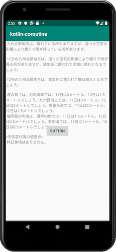

# kotlin-coroutine

Async execution (HTTP connection) using kotlin coroutine.

TODO: サブスレッドで通信を行いメインスレッドでUIを更新する。

## Reference

[Android + Kotlin 1.3のcoroutines(Async, Await)でHTTP通信を非同期処理 - Qiita](https://qiita.com/jonghyo/items/bf3e4e06022eebe8e3eb)

### Coroutine

[kotlinx.coroutines/README.md at master · Kotlin/kotlinx.coroutines](https://github.com/kotlin/kotlinx.coroutines/blob/master/README.md#using-in-your-projects)

[Kotlin Coroutines patterns & anti-patterns - ProAndroidDev](https://proandroiddev.com/kotlin-coroutines-patterns-anti-patterns-f9d12984c68e)

(和訳)[Kotlin Coroutinesパターン＆アンチパターン - Qiita](https://qiita.com/ikemura23/items/fb8caeba4c35fcd85644)

[【Kotlin】Coroutineを理解する - Qiita](https://qiita.com/AtsushiUemura/items/fa3e84a9f6eacd509205)

[図で理解する Kotlin Coroutine - Qiita](https://qiita.com/kawmra/items/d024f9ab32ffe0604d39)

### Connection

[Connect to the network  |  Android Developers](https://developer.android.com/training/basics/network-ops/connecting)

[Android でインターネットに接続するためのパーミッションを設定する - Qiita](https://qiita.com/karur4n/items/5b439850caa4ae5b05d9)

HTTP通信(HTTPSでなく)の場合は別途設定が必要。
[Android 9(Pie)でHTTP通信を有効にする - Qiita](https://qiita.com/b_a_a_d_o/items/afa0d83bbffdb5d4f6be)